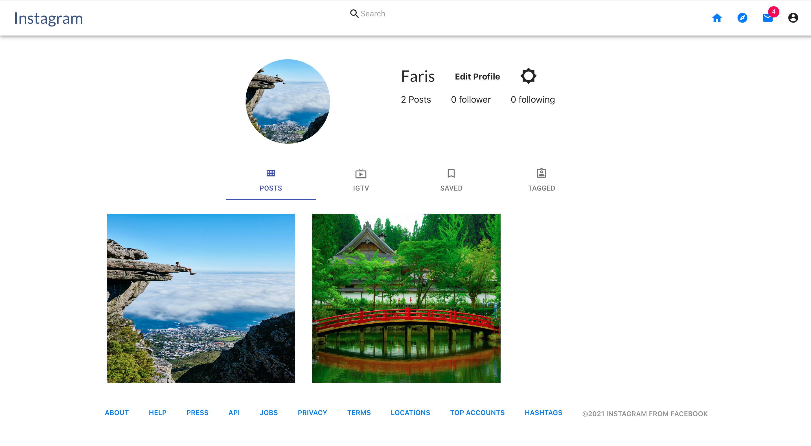

# Instagram_app

**Instagram_app** is a clone of a Social Media Web App Instagram. It is a Full-Stack Web App that allows user to connect with their friends and their families. Users can publish their photos, comments and likes the posts.

# Live Site @ [Instagram_app](https://sihame-instagram-clone.netlify.app)

## Table of Contents

  - [Installation Instructions](#installation-instructions)
  - [Features](#features)
  - [Technologies](#technologies)
  - [Learn More](#learn-more)

## Installation Instructions

1. Fork and clone this repository
2. To install the all necessary package for backend cd to backend then run `npm i` or `npm install `
3. From the root folder in the backend run `psql -f backend/db/schema.sql` (This will create the local database)
   - You might want to check to make sure the database was correctly created.
4. In the root folder run `nodemon` (This will run the backend)
5. After you run the backend, now you can `cd frontend` and run `npm i` or `npm install` to install all necessary packages
6. Start coding! (to check the live test run `npm start` in the frontend folder
7. For login, sign up, and upload pictures make sure you read the [Firebase documentation](https://firebase.google.com/).

## Features

Users can:

- Create an account with Firebase 
  
    
- Create login with Firebase
 
    
- View user profile by other users 

    

- View all posts by other users
- Like and comment on other users posts
- Search for other users
- Update their own profile

## Technologies

Instagram_app was created using

- React
- Express.js
- Firebase
- SQL
- Material UI
- Bootstrap

## Learn More

To learn more about how to [Create React App](https://facebook.github.io/create-react-app/docs/getting-started).

To learn React, check out the [React documentation](https://reactjs.org/).

To learn about [Express.js](https://www.guru99.com/node-js-express.html).

To learn about [Firebase](https://firebase.google.com/).

To learn about [SQL](https://www.postgresql.org/docs/current/index.html).

To learn about [Material UI](https://material-ui.com/).

To learn about [Bootstrap](https://react-bootstrap.github.io/).
